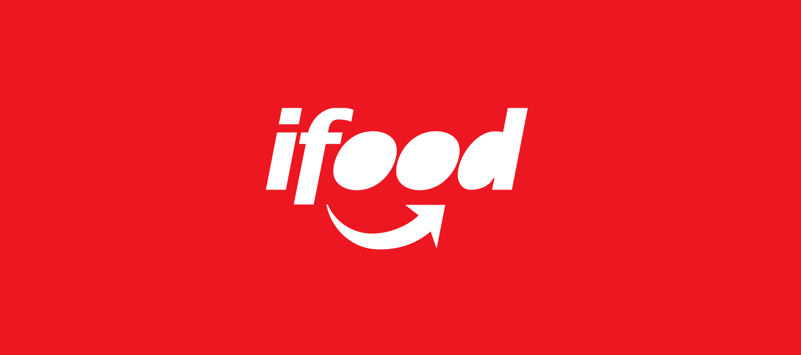

# iFood MARKETING CAMPAIGN

## Predicting customers that will by a gadget.
 

## This projets has a gol to maximize the results of a marketing campaign and generate value to the company.

#### This project was made by Alisson Lisboa.

# 1. Business Problem.

## The Company
Consider a well-established company operating in the retail food sector. Presently they have around
several hundred thousands of registered customers and serve almost one million consumers a year.
They sell products from 5 major categories: wines, rare meat products, exotic fruits, specially
prepared fish and sweet products. These can further be divided into gold and regular products. The
customers can order and acquire products through 3 sales channels: physical stores, catalogs and
the company’s website. Globally, the company had solid revenues and a healthy bottom line in the
past 3 years, but the profit growth perspectives for the next 3 years are not promising... For this
reason, several strategic initiatives are being considered to invert this situation. One is to improve
the performance of marketing activities, with a special focus on marketing campaigns.

## The Marketing Department
The marketing department was pressured to spend its annual budget more wisely. The CMO
perceives the importance of having a more quantitative approach when taking decisions, reason why
a small team of data scientists was hired with a clear objective in mind: to build a predictive model
which will support direct marketing initiatives. Desirably, the success of these activities will prove the
value of the approach and convince the more skeptical within the company.

## The Objective
The objective of the team is to build a predictive model that will produce the highest profit for the
next direct marketing campaign, scheduled for the next month. The new campaign, sixth, aims at
selling a new gadget to the Customer Database. To build the model, a pilot campaign involving
2.240 customers was carried out. The customers were selected at random and contacted by phone
regarding the acquisition of the gadget. During the following months, customers who bought the
offer were properly labeled. The total cost of the sample campaign was 6.720MU and the revenue
generated by the customers who accepted the offer was 3.674MU. Globally the campaign had a
profit of -3.046MU. The success rate of the campaign was 15%. The objective is of the team is to
develop a model that predicts customer behavior and to apply it to the rest of the customer base.
Hopefully, the model will allow the company to cherry-pick the customers that are most likely to
purchase the offer while leaving out the non-respondents, making the next campaign highly
profitable. Moreover, other than maximizing the profit of the campaign, the CMO is interested in
understanding to study the characteristic features of those customers who are willing to buy the
gadget.

# 2. Business Assumptions.
The assumptions about the business problem is as follows:
 
 * The cause number 1 of the money loss is don't know wich custumer will buy the gadget before a call.
 * The gadget to be sold meets customer expectations.

# 3. Solution Strategy

My strategy to solve this challenge was:

**Step 01. Data Description:** My goal is to use statistics metrics to identify data outside the scope of business.

**Step 02. Feature Engineering:** Derive new attributes based on the original variables to better describe the phenomenon that will be modeled.

**Step 03. Data Filtering:** Filter rows and select columns that do not contain information for modeling or that do not match the scope of the business.

**Step 04. Exploratory Data Analysis:** Explore the data to find insights and better understand the impact of variables on model learning.

**Step 05. Data Preparation:** Prepare the data so that the Machine Learning models can learn the specific behavior.

**Step 06. Feature Selection:** Selection of the most significant attributes for training the model.

**Step 07. Machine Learning Modelling:** Machine Learning model training

**Step 08. Hyperparameter Fine Tunning:** Choose the best values for each of the parameters of the model selected from the previous step.

**Step 09. Convert Model Performance to Business Values:** Convert the performance of the Machine Learning model into a business result.

**Step 10. Deploy Modelo to Production:** Publish the model in a cloud environment so that other people or services can use the results to improve the business decision.

# 4. Top 3 Data Insights

**Hypothesis 01:** Customer that buy more Gold products should accept the gadget.
 
**False** - Customers that buy more Gold Products tend not accept the gadget

**Hypothesis 02:** Customers with lower age tend age accept the gadget.
 
**False** - Custumers with average age accept more the gadget

**Hypothesis 03:** Customers with lower age buy more.
 
**False** - Median age customer buy more.

# 5. Machine Learning Model Applied

The models applied was Random Forest Classifier and XGBoost Classifier

# 6. Machine Learning Model Performance

The summary below shows the metrics comparison after running a cross validation score with stratified K-Fold with 5 splits in the full data set.

| model_name             | final_score |
| :--------------------- | ----------- |
| RandonForestClassifier | 0.890179    |
| XGBClassifier          | 0.890625    |

# 7. Business Results

The given data didn't contain a test data set, so that I have used the training dataset to get de business estimates as follow:

| net_profit_before  | net_profit_after |
| ------------------ |----------------- |
| -3046.0 MU         |2527.0 MU         |

The customers can be divided in two groups, according to the total number of purchases and total expent, with average data as follows:

|label |income       |recency   |mnt_total   |complain|num_total_purchases  |accepted_total |household_people |age       |days_since_enrolled |count |
|-----:|------------:|---------:|-----------:|--------:|-------------------:|--------------:|----------------:|---------:|-------------------:|-----:|
|0     |69752.303518 |49.341709 |1704.166834 |0.008040 |19.465327           |0.554774       |1.249246         |54.203015 |2872.261307         |995   |
|1     |37746.376305 |48.923695 |195.621687  |0.010442 |7.000000            |0.092369       |1.871486         |50.588755 |2827.858635         |1245  |

This division allows the marketing team to better understand the customer segmentation and take diferent actions on it.

# 8. Conclusions

Predicting the customer that probably won't accept the gadget, we can call only those that will accept.

Doing so, I estimate to revert a loss of **3,000 MU** to a profit about **2,500 MU**.

# 9. Lessons Learned

* Understand the dataset and obtain insights from it are crucial for the project success.
* The models must be trained with as much data as possible.
* The appropriate metric to evaluate the best model must be determined according to the goal of the project / business.
* Sometimes is better reduce the number of features in order to simplify the model and improve the result.

# 10. Next Steps to Improve

* **Develop an app** that intakes a portfolio of customers and assigns for each customer its respective label of buying a new gadget.
* Talk to the **business team** to check if there is **more relevant features**
* Create **new hypothesis** about the problem
* Apply other algorithms
* Improve Hyperparameter fine tuning techniques
* Build a model **retraining pipeline.**
